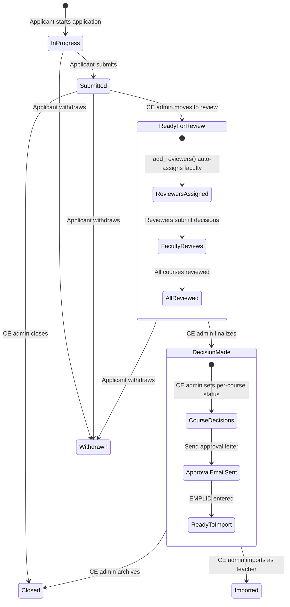
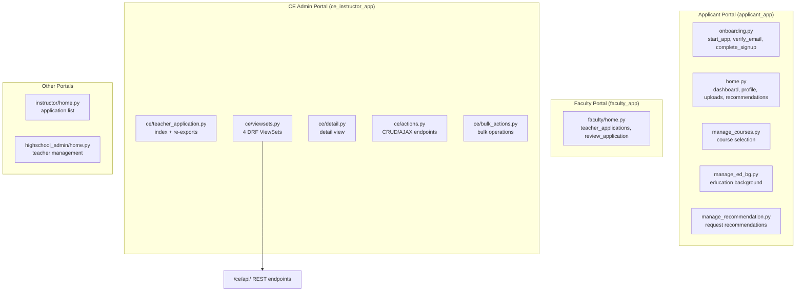
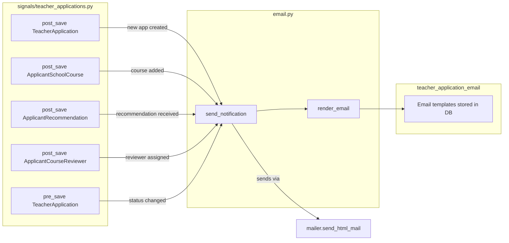
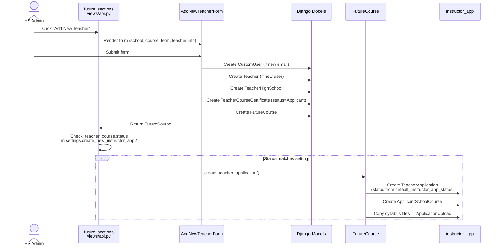

# Architecture Guide — `instructor_app`

## Data Model

```mermaid
erDiagram
    CustomUser ||--o| TeacherApplicant : "one-to-one"
    CustomUser ||--o{ TeacherApplication : "has many"
    TeacherApplication }o--|| HighSchool : "belongs to"
    TeacherApplication ||--o{ ApplicantSchoolCourse : "has many"
    TeacherApplication ||--o{ ApplicantRecommendation : "has many"
    TeacherApplication ||--o{ ApplicationUpload : "has many"
    ApplicantSchoolCourse }o--|| Course : "references"
    ApplicantSchoolCourse }o--|| HighSchool : "references"
    ApplicantSchoolCourse ||--o{ ApplicantCourseReviewer : "has many"
    ApplicantCourseReviewer }o--|| CustomUser : "reviewer"

    TeacherApplicant {
        uuid id PK
        fk user FK
        string status
        boolean account_verified
        uuid verification_id
    }

    TeacherApplication {
        uuid id PK
        fk user FK
        fk highschool FK
        fk assigned_to FK
        string status
        date createdon
        json misc_info
        json status_changed_on
    }

    ApplicantSchoolCourse {
        uuid id PK
        fk teacherapplication FK
        fk course FK
        fk highschool FK
        fk starting_academic_year FK
        string status
        string note
        json misc_info
    }

    ApplicantCourseReviewer {
        uuid id PK
        fk application_course FK
        fk reviewer FK
        date assigned_on
        string status
        json misc_info
        json status_changed_on
    }

    ApplicantRecommendation {
        uuid id PK
        fk teacher_application FK
        date submitted_on
        json submitter
        json recommendation
        file upload
    }

    ApplicationUpload {
        uuid id PK
        fk teacher_application FK
        json associated_with
        file upload
    }
```

## Application Status State Machine



**Status options**: `In Progress`, `Submitted`, `Under Review`, `Ready for Review` (configurable label), `Decision Made`, `Withdrawn`, `Closed`

**Key side effects on status change** (via signals + `FieldTracker`):
- → `Ready for Review`: `add_reviewers()` auto-assigns `FacultyCoordinator` users for each course
- → Any change: `notify_status_change()` emails the applicant
- → `Decision Made`: Enables approval email and "Import as Instructor" actions

## Course Review Status

Each `ApplicantSchoolCourse` has its own status set by CE admin after faculty review:

| Status | Meaning |
|--------|---------|
| `---` | Not yet decided |
| `Accepted` | Course approved |
| `Conditionally Accepted` | Approved with conditions |
| `Denied` | Course denied |

Each `ApplicantCourseReviewer` (faculty) has a review decision:

| Status | Meaning |
|--------|---------|
| `---` | Not yet reviewed |
| `Approved` | Faculty recommends approval |
| `Declined` | Faculty recommends denial |
| `Need more information` | Faculty needs more info |

## View Architecture



## Email & Notification System



**Email flow**: Settings store Django template strings → `render_email()` renders with `Template`/`Context` → wraps in `cis/email.html` layout → `send_notification()` sends via mailer.

## Service Layer

| Service | Location | Purpose |
|---------|----------|---------|
| `import_teacher` | `services/import_teacher.py` | Converts approved `TeacherApplication` → `Teacher` + `TeacherHighSchool` + `TeacherCourseCertificate` + copies uploads |
| `pdf` | `services/pdf.py` | Generates PDF of application via `pdfkit`, renders `ce/details_single.html` |

## Future Sections Integration



**Configuration** (in `future_sections` admin settings):

| Setting | Type | Description |
|---------|------|-------------|
| `allow_new_teacher_create` | Yes/No | Master toggle for the "Add New Teacher" button |
| `create_new_instructor_app` | MultiSelect | Which `TeacherCourseCertificate` statuses trigger auto-creation (e.g., `["Applicant"]`) |
| `default_instructor_app_status` | Select | Initial status for auto-created applications (default: "In Progress") |

**Validation**: When `allow_new_teacher_create` is enabled, `teacher_course_status` must include "Applicant" (enforced by form validation in `future_sections/forms.py`).

**What gets created**:
1. `TeacherApplication` — linked to the teacher's `CustomUser` and `HighSchool`, with status from the `default_instructor_app_status` setting
2. `ApplicantSchoolCourse` — links the application to the specific course being requested
3. `ApplicationUpload` — any syllabus files from the section request are downloaded from S3 and attached

## Settings Architecture

All three setting groups are registered in `apps.py` via `CONFIGURATORS` and stored in the `Setting` model (from the `setting` package):

```python
class InstructorAppConfig(AppConfig):
    CONFIGURATORS = [
        incomplete_si_application,    # Reminder cron config
        teacher_application_email,    # Email templates
        inst_app_language,            # UI text + app settings
    ]
```

Each setting class inherits from a `SettingForm` base and exposes a `from_db()` classmethod that loads the stored configuration as a dictionary.

## External Dependencies

**Models from other apps**:
- `CustomUser`, `Course`, `CourseAppRequirement`, `Cohort`, `HighSchool`, `AcademicYear`, `FacultyCoordinator`, `Teacher`, `TeacherHighSchool` — from `cis`
- `TeacherApplicationNote` — from `cis.models.note`
- `Alert` — from `alerts`
- `Setting` — from `setting` package

**Packages**: `django-recaptcha`, `django-crispy-forms`, `model_utils` (FieldTracker), `pdfkit`, `mailer`
