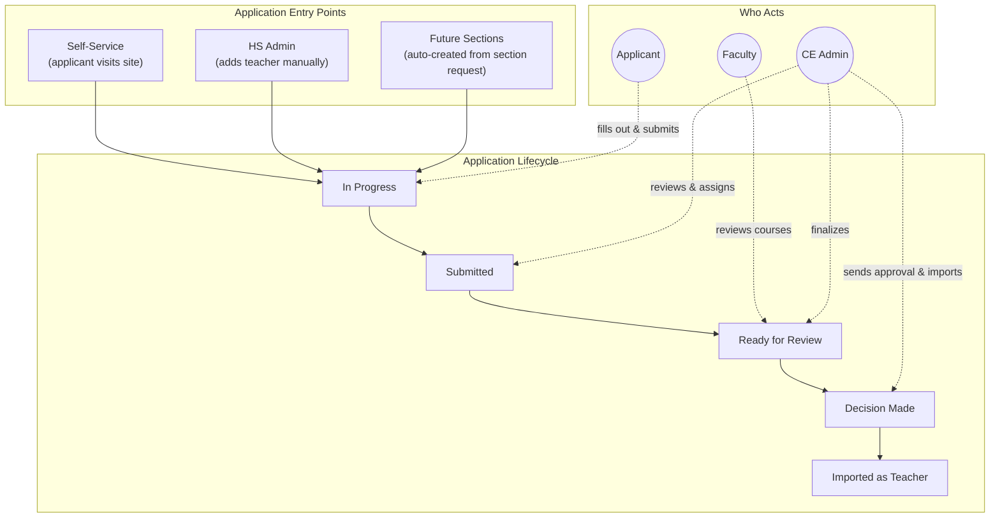
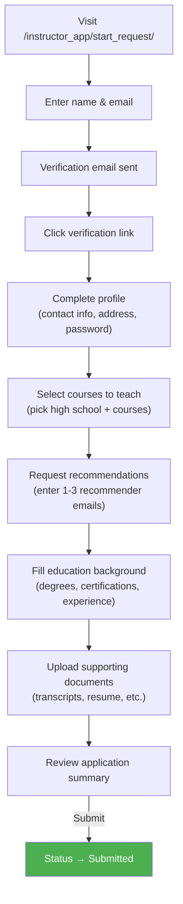
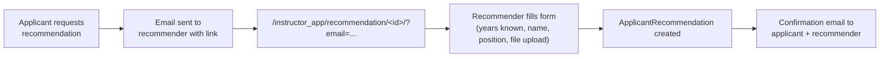
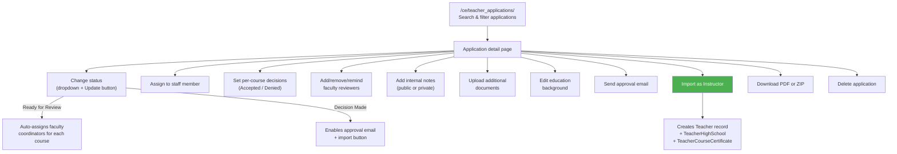
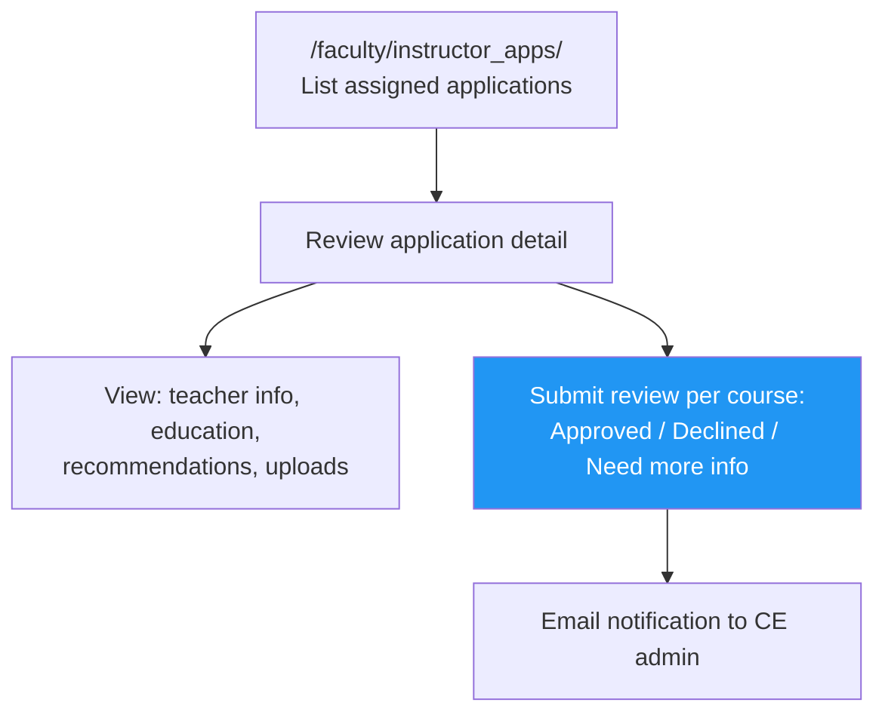
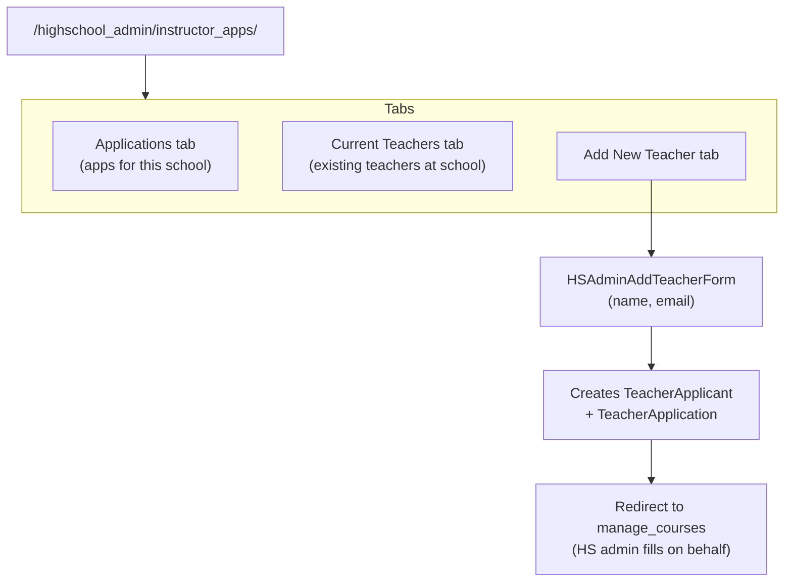
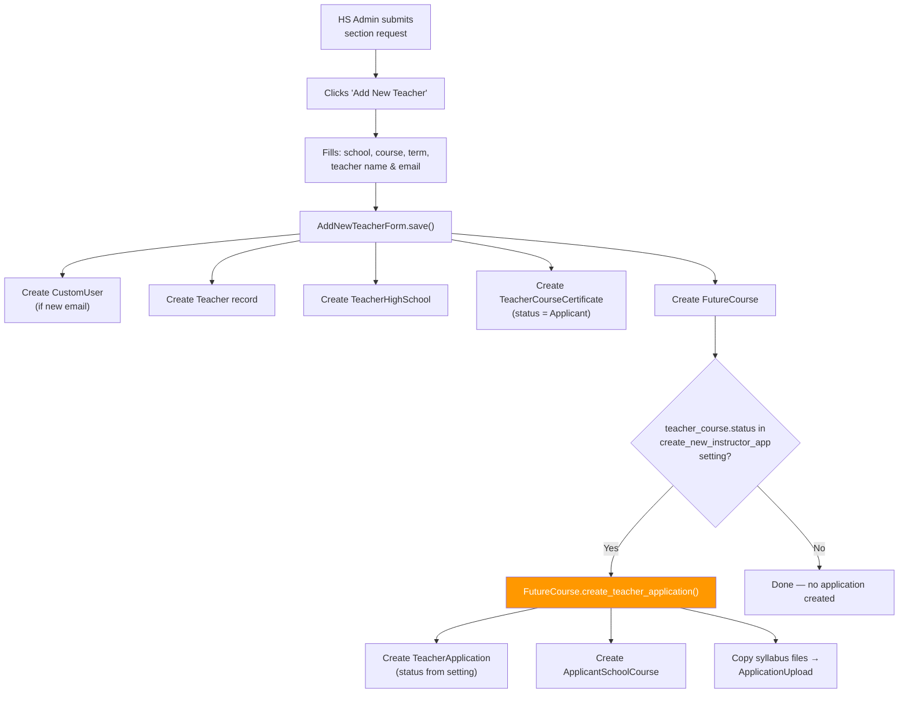
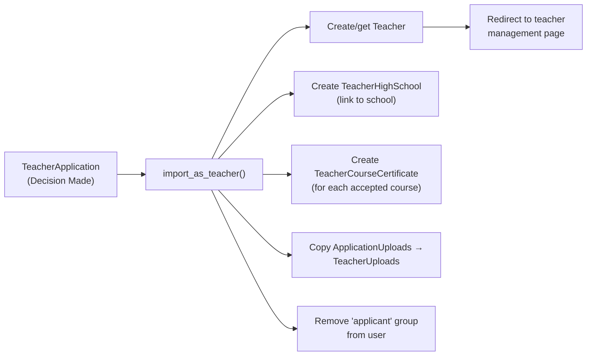

# Product Guide — Instructor Application System

This guide describes the end-to-end workflows for each user role in the instructor application system.

## System Overview

---

## 1. Applicant Flow

The self-service path for a new high school teacher to apply.

**Step details:**

| Step | View | Template | What happens |
|------|------|----------|-------------|
| Start | `onboarding.start_app` | `start-app.html` | Creates `TeacherApplicant`, sends verification email |
| Verify | `onboarding.verify_email` | `confirm_verification.html` | Sets `account_verified=True` |
| Profile | `onboarding.complete_signup` | `complete_signup.html` | Creates `CustomUser` + `TeacherApplication` (In Progress) |
| Courses | `manage_courses.manage_course` | `manage_course.html` | Creates `ApplicantSchoolCourse` per course |
| Recommendations | `manage_recommendation` | `request_recommendation.html` | Stores recommender info, sends request emails with public links |
| Education | `manage_ed_bg` | `manage_ed_bg.html` | Saves to `CustomUser.education_background` JSONField |
| Uploads | `home.manage_uploads` | `manage_uploads.html` | Creates `ApplicationUpload` per file |
| Review | `home.review_application` | `review_application.html` | Validates completeness, POST → status="Submitted" |

**Completion requirements** (checked by `can_submit()`):
- At least one course selected
- Required recommendations received (0–3, configurable)
- Education background filled
- Required documents uploaded per course

**Post-submission**: Applicant can view but not edit. They can track status via the dashboard.

---

## 2. Recommendation Flow

External recommenders (not system users) submit recommendations via a public link.

- **Public view** — no login required, validated by email match
- Recommender uploads a file (stored in private S3 storage)
- Signals trigger confirmation emails on save

---

## 3. CE Admin Flow

Staff at the concurrent enrollment office manage all applications.

**Index page tabs:**

| Tab | Data Source | Description |
|-----|-----------|-------------|
| Active | `TeacherApplicationViewSet` (active_only=true) | Non-withdrawn, non-closed applications |
| All Applications | `TeacherApplicationViewSet` | All applications |
| By Reviewers | `TeacherApplicationReviewerViewSet` | Grouped by faculty reviewer |
| Pending Verification | `TeacherApplicantViewSet` (pending_only=true) | Unverified applicant accounts |

**Key actions on detail page:**

| Action | Trigger | Effect |
|--------|---------|--------|
| Change to "Ready for Review" | Status dropdown | `add_reviewers()` auto-assigns faculty, sends review request emails |
| Set course decision | Per-course form | Updates `ApplicantSchoolCourse.status` |
| Send approval email | Button (when Decision Made) | Sends configurable approval letter to applicant |
| Import as Instructor | Button (when Decision Made + EMPLID set) | Creates `Teacher`, copies uploads, creates course certifications |
| Download ZIP | Link | Generates ZIP with PDF + all uploads + recommendations |

---

## 4. Faculty Review Flow

Faculty coordinators review courses they're assigned to.

- Faculty only see applications where they are an `ApplicantCourseReviewer`
- Can submit a decision + reviewer note per course
- Can update their recommendation until CE admin acts on it
- Review form uses `ApplicantReviewForm` with status + note fields

---

## 5. HS Admin Flow

High school administrators manage applications for their school's teachers.

- HS admins see only applications linked to their school(s)
- "Add New Teacher" creates an applicant record and redirects the HS admin into the application steps to fill out on behalf of the teacher
- The applicant receives a verification email and can take over later

---

## 6. Instructor Portal

Existing instructors (already in the system as `Teacher`) can view and track their own applications.

- URL: `/instructor/instructor_apps/`
- Lists all `TeacherApplication` records for the logged-in user
- Shows status, courses, and high school per application
- If application is editable (In Progress), links to the edit flow
- If not editable, shows read-only view

---

## 7. Future Sections Integration

When HS admins submit section requests through the `future_sections` app, new teacher applications can be created automatically.

**Configuration required** (in `future_sections` admin settings):

1. Set `allow_new_teacher_create` = **Yes**
2. Add "Applicant" to `teacher_course_status` (enforced by form validation)
3. Select statuses in `create_new_instructor_app` that should trigger app creation (e.g., `["Applicant"]`)
4. Set `default_instructor_app_status` (e.g., "In Progress" or "Submitted")

---

## 8. Email Notifications

All email templates are configurable via the `teacher_application_email` admin setting.

| Trigger | Who Receives | Template Setting Key |
|---------|-------------|---------------------|
| New application created | Applicant | `new_applicant_email` |
| Course added to application | CE staff | `course_selected_email` |
| Application submitted | CE staff | `app_submitted_email` |
| Status → Ready for Review | Faculty reviewers | `fc_ready_email` |
| Faculty completes review | CE staff / assigned_to | `course_reviewed_email` |
| Status → Decision Made | Applicant | `app_decision_made_email` |
| Approval letter sent | Applicant | `app_approved_email` |
| Incomplete app reminder | Applicant | Configured in `incomplete_si_application` |

**Template variables available**: `{{ teacher_first_name }}`, `{{ teacher_last_name }}`, `{{ teacher_email }}`, `{{ applicant_highschool }}`, `{{ approved_courses_only_as_a_list }}`, `{{ application_status }}`, `{{ recommendation_request_link }}`, `{{ course }}`, `{{ reviewer_name }}`, `{{ reviewer_note }}`

---

## 9. Import as Teacher (Final Step)

When an application reaches "Decision Made" and the EMPLID is set, CE admin can import:

**Requirements**: `decision_letter_sent_on` must be set in `misc_info` (raises `KeyError` otherwise).
