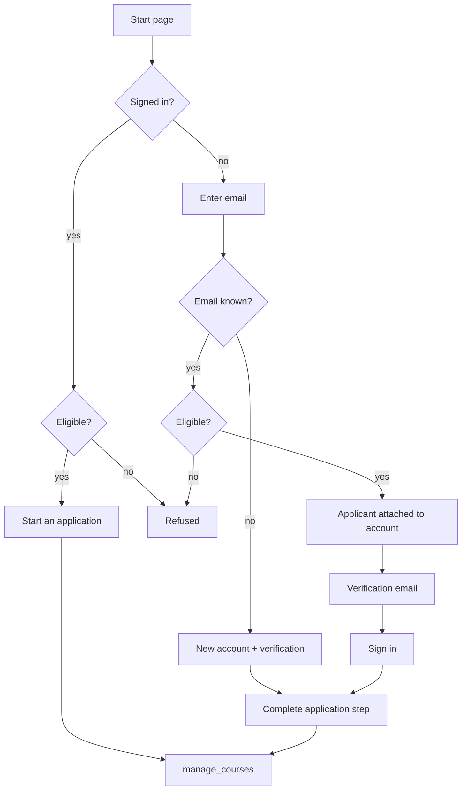

# Instructor Application (`instructor_app`)

A Django app that manages the full lifecycle of high school instructor applications for concurrent enrollment programs. It supports self-service onboarding, multi-role review workflows, faculty coordination, and automated notifications.

## Quick Reference

| Portal | URL Prefix | Namespace | Role |
|--------|-----------|-----------|------|
| Applicant | `/instructor_app/` | `applicant_app` | Self-service application |
| Instructor | `/instructor/instructor_apps/` | `instructor_app` | View own applications |
| Faculty | `/faculty/instructor_apps/` | `faculty_app` | Review assigned applications |
| HS Admin | `/highschool_admin/instructor_apps/` | `highschool_admin_app` | Manage school's teachers |
| CE Admin | `/ce/` | `ce_instructor_app` | Full application management + API |

## Role Access

The application step URLs (manage_courses, manage_recommendation, manage_ed_bg, manage_uploads, review_application, etc.) use `user_has_applicant_role` which grants access to:

- `applicant` — New teacher applicants
- `instructor` — Existing instructors starting a new application
- `highschool_admin` — HS admins viewing/starting applications for their schools

This is defined in `cis/utils.py`. The `highschool_admin` role was added to `user_has_applicant_role` to allow HS admins to access the application steps when starting or viewing applications from their portal.

## Onboarding an Email That Already Exists

By default the public start page dead-ends on any known email: *"This email is already
registered in the system."* Setting `allow_existing_users_to_apply` to **Yes** lets some
existing accounts start an application instead, attaching a `TeacherApplicant` to the
account they already have.

### Who is eligible

| Existing account holds | Result |
|---|---|
| `student`, `instructor`, or `highschool_admin` | Allowed |
| `ce` or `faculty`, and nothing else | Refused — staff and faculty may not submit an application |
| An eligible role **and** `ce`/`faculty` | Allowed — allow-wins; a denied role only blocks when no eligible role is present |
| No groups at all | Allowed — these should not exist, and the flow leaves them with the `applicant` role |
| `district_admin`, `speaker`, `tech_center_staff` | Refused (default-deny) |
| `applicant` already, verified | Refused — told to log in or reset their password |
| `applicant` already, unverified | Verification email resent, as before |

Eligibility lives in `services/applicant_eligibility.py` so the rule has one home.
Creating the `TeacherApplicant` is what grants the `applicant` role (`TeacherApplicant.save()`);
every other role the account holds is left in place.

### Flow



### What the existing-user path never touches

The complete-application step sets a password and rewrites profile fields, and it is served
from a public URL. For an account that already exists that would be an unauthenticated
password reset affecting every role the account holds. So on this path:

- The **password fields are removed** from the form. The account keeps its password;
  forgotten passwords go through the normal reset flow.
- The step **requires a real login** — the mailed link proves inbox control, which is
  enough to provision a new account but not to hand out a session on one that already has
  privileges. It also refuses a *different* signed-in user.
- Profile fields are **prefilled** from the user record, except **SSN and date of birth**,
  which render blank and are preserved on save rather than being echoed into a public form.

An applicant flagged this way carries `meta['pre_existing_account'] = True`, which is what
drives all three behaviors.

### Prior applications

`start_or_resume_application()` resumes the account's most recent application when it is
still live, and starts a new one when the most recent is `Decision Made`, `Withdrawn`, or
`Closed`. The main way a user ends up with a retained application and no applicant role is
**Import as Instructor**, which deliberately keeps the application as the record of how
they became an instructor — resuming that would hand a returning applicant an
already-decided application.

Deleting an application from the CE portal already removes the `TeacherApplication` and its
children, and revoking applicant access deletes the `TeacherApplicant`; no orphan is left
behind on that path.

| File | Purpose |
|------|---------|
| `services/applicant_eligibility.py` | Who may apply — allowlist and allow-wins rule |
| `services/applications.py` | Create or resume the `TeacherApplication` |
| `forms/teacher_applicant.py` | `clean_email` branching, `_attach_to_existing_user`, password/SSN handling |
| `views/onboarding.py` | Verification routing, signed-in shortcut, `complete_signup` guards |

## Directory Structure

```
instructor_app/
├── models/
│   ├── __init__.py
│   ├── teacher_applicant.py          # Re-export shim (backward compat)
│   ├── teacher_applicant_model.py    # TeacherApplicant
│   ├── teacher_application.py        # TeacherApplication (main model)
│   ├── applicant_school_course.py    # ApplicantSchoolCourse
│   ├── applicant_course_reviewer.py  # ApplicantCourseReviewer
│   ├── applicant_recommendation.py   # ApplicantRecommendation
│   └── application_upload.py         # ApplicationUpload
├── views/
│   ├── onboarding.py                 # Registration & verification
│   ├── home.py                       # Applicant dashboard & uploads
│   ├── manage_courses.py             # Course selection
│   ├── manage_ed_bg.py               # Education background
│   ├── manage_recommendation.py      # Recommendation requests
│   ├── instructor/home.py            # Instructor portal
│   ├── faculty/home.py               # Faculty review portal
│   ├── highschool_admin/home.py      # HS admin portal
│   └── ce/
│       ├── teacher_application.py    # Re-export shim + index view
│       ├── viewsets.py               # DRF ViewSets (API)
│       ├── detail.py                 # Application detail view
│       ├── actions.py                # CRUD/AJAX action endpoints
│       ├── bulk_actions.py           # Bulk operations
│       ├── incomplete_notifications.py  # Preview/send incomplete-app reminders
│       └── pending_review_notifications.py # Preview/send reviewer reminders
├── forms/
│   └── teacher_applicant.py          # All forms
├── serializers/
│   └── teacher_application.py        # DRF serializers
├── urls/
│   ├── applicant.py                  # Public + applicant routes
│   ├── instructor.py                 # Instructor routes
│   ├── faculty.py                    # Faculty routes
│   ├── highschool_admin.py           # HS admin routes
│   └── cis.py                        # CE admin + API routes
├── templates/instructor_app/
│   ├── ce/                           # CE admin templates
│   ├── faculty/                      # Faculty templates
│   ├── highschool_admin/             # HS admin templates
│   ├── instructor/                   # Instructor templates
│   └── *.html                        # Applicant templates
├── staticfiles/js/                   # Extracted JS (DataTables, AJAX)
├── settings/
│   ├── teacher_application_email.py  # Email templates config
│   ├── inst_app_language.py          # UI text & app settings
│   └── incomplete_si_application.py  # Reminder notification config
├── signals/
│   └── teacher_applications.py       # Status change & notification handlers
├── services/
│   ├── import_teacher.py             # Convert applicant → Teacher
│   ├── pdf.py                        # PDF generation
│   ├── incomplete_notifications.py   # Logic for incomplete-app reminders
│   └── pending_review_notifications.py # Logic for pending-review reminders
├── email.py                          # render_email / send_notification helpers
├── utils.py                          # Role checks & access control
├── management/commands/
│   ├── notify_incomplete_si_app.py   # Cron: remind incomplete applicants
│   └── notify_si_pending_review.py   # Cron: remind pending reviewers
└── apps.py                           # App config + settings registration
```

## Configuration (Admin Settings)

Three setting groups are registered in `apps.py` and editable via the admin UI:

### `inst_app_language` — Application Settings & UI Text
| Setting | Description |
|---------|-------------|
| `is_accepting_new` | Master toggle (Yes/No) for new applications |
| `recommendations_needed` | Number of recommendations required (0–3) |
| `allow_new_school` | Allow applicants to add unlisted high schools |
| `allow_existing_users_to_apply` | Let a student / instructor / HS admin who already has an account start an application with that email instead of being refused. Default **No**. See [Onboarding an Email That Already Exists](#onboarding-an-email-that-already-exists) |
| `fc_review_status_label` | Custom label for the "Ready for Review" status |
| `reviewer_role_config` | JSON dict of `{"RoleName": weight}` controlling which `CourseAdministrator` roles are auto-added as reviewers and in what order (lower weight = added first) when an application reaches the faculty review trigger status. Defaults to `{"Faculty": 1}`. |
| `checklist_config` | JSON config for pre-approval checklist items |
| `app_submitted_message` | Text shown on the review page once the application has been submitted and is no longer editable. Falls back to the built-in wording when unset. |
| `applicant_submitted_email_active` | Yes/No — send the applicant a confirmation email when their application is submitted. Default **No**. See [Applicant Submission Confirmation](#applicant-submission-confirmation) |
| `applicant_submitted_email_subject` | Subject line for that confirmation |
| `applicant_submitted_email` | Body for that confirmation. Supports `{{teacher_first_name}}`, `{{teacher_last_name}}`, `{{teacher_email}}`, `{{highschool}}`, `{{courses}}`, `{{application_status}}` |

Also configures page introductions, form field labels, and help text for every applicant-facing screen.

## Applicant Submission Confirmation

Separate from the *internal* "application submitted" notice configured under
`teacher_application_email` (key `tapp_email`), this is an email to the **applicant**,
confirming their own submission. It is off by default — switching it on is a per-tenant
decision, since it emails real applicants.

Turn it on under **Settings → Instructor → Instructor Application Page** by setting
*Send Submission Confirmation to Applicant* to **Yes** and filling in the subject and body.

### When it sends

The send lives in `TeacherApplication.notify_status_change()`, in the `submitted` branch,
and fires on **every genuine transition into `Submitted`** — the applicant's own submit, and
a staff move from any other status back to `Submitted`.

It is guarded by `self.tracker.previous('status') != self.status`, which matters because
`notify_status_change` has a second, signal-independent caller: `AddCourseForm.save()`
re-invokes it with the application's *current* status whenever staff add a course. Without
the guard, adding a course to an already-submitted application would send the applicant a
duplicate confirmation. Do not remove the guard; `test_add_course_form_save_queues_no_duplicate_applicant_email`
and `test_resends_when_status_transitions_into_submitted_again` pin both halves of the
behaviour.

The send is deliberately placed **above** the internal branch's
`if 'app_submitted' not in notify_on: return` gate, so turning off internal staff
notifications does not silently suppress the applicant's email.

### Fallbacks

Subject and body resolve through `get_applicant_submitted_email()`, which falls back to
`APPLICANT_SUBMITTED_EMAIL_SUBJECT_DEFAULT` / `APPLICANT_SUBMITTED_EMAIL_DEFAULT` when the
key is missing or blank — so an upgraded tenant that has not yet saved the settings form
still previews and sends a sensible email rather than 500ing or silently sending nothing.
`app_submitted_message` resolves the same way through `get_app_submitted_message()`.

## Material Upload Requirements ("For" checkboxes)

`AppUploadForm` lists every `CourseAppRequirement` belonging to the courses the applicant
selected. Two courses can each define a requirement called "Transcript", so the labels are
prefixed with their course — `"{course.title} {course.name} — {req.name}"` — and ordered by
course, making identically-named requirements distinguishable.

Choice **values** remain the requirement UUID (`str(req.id)`), so existing
`ApplicationUpload.associated_with` rows keep resolving; `test_values_are_still_requirement_ids`
pins this. A requirement with no course keeps its bare name.

Note the CE-side `EditTeacherAppCourseUploadForm` still uses its own older convention
(`"{req.name} for {req.course.name}"`); aligning the two is outstanding.

### `teacher_application_email` — Email Templates
Configurable subject lines and body templates for: new applicant, course selected, submitted, decision made, faculty review ready, course reviewed, approval letter, and internal notifications. Templates support Django template syntax with context variables like `{{ teacher_first_name }}`, `{{ approved_courses_only_as_a_list }}`, etc.

### `incomplete_si_application` — Reminder Notifications
Controls the cron job that emails applicants with incomplete applications. Configurable frequency, email template, and active/inactive toggle.

## API Endpoints

All at `/ce/api/` with `?format=datatables` support:

| Endpoint | ViewSet | Description |
|----------|---------|-------------|
| `teacher_applicant/` | `TeacherApplicantViewSet` | Applicant accounts |
| `teacher_application/` | `TeacherApplicationViewSet` | Applications (filterable by status, course, reviewer, academic year) |
| `teacher_application_reviewers/` | `TeacherApplicationReviewerViewSet` | Reviewer assignments |
| `applicant_course_list/` | `ApplicantCourseListViewSet` | Applicant's course selections |

## Integration: Course Requirements Tab on Courses Page

`instructor_app` adds a **By Requirements** tab and **Update Availability** bulk action to the host app's CE courses page (`/ce/courses/`). This requires four changes in the host app's `cis` module.

### 1. `cis/forms/course.py` — Add `CourseSIAvailabilityChangeForm`

```python
class CourseSIAvailabilityChangeForm(forms.Form):
    available_for_si = forms.ChoiceField(
        choices=YES_NO_SELECT_OPTIONS, required=False,
        label='Available for New Instructor Applicants'
    )
    course_ids = forms.MultipleChoiceField(
        required=False, label='Records to Update',
        widget=forms.CheckboxSelectMultiple, choices=[]
    )
    action = forms.CharField(widget=forms.HiddenInput)
    field_order = ['course_ids', 'action']

    def __init__(self, course_ids=None, *args, **kwargs):
        super().__init__(*args, **kwargs)
        self.fields['action'].initial = 'change_si_availability'
        self.fields['available_for_si'].required = False
        self.fields['available_for_si'].help_text = 'Leave blank to retain current value'
        if course_ids:
            courses = Course.objects.filter(id__in=course_ids)
            self.fields['course_ids'].choices = [(c.id, c.name) for c in courses]
            self.fields['course_ids'].initial = course_ids
        else:
            self.fields['course_ids'].choices = [
                (cid, cid) for cid in kwargs.get('data').getlist('course_ids')
            ]

    def save(self, request=None):
        from cis.models.note import CourseNote
        data = self.cleaned_data
        for course_id in data.get('course_ids'):
            try:
                course = Course.objects.get(id=course_id)
                if data.get('available_for_si'):
                    course.meta['available_for_si'] = data['available_for_si']
                    CourseNote(course=course, createdby=request.user,
                               note='Changing SI Availability<br>').save()
                    course.save()
            except Exception:
                pass
```

### 2. `cis/views/course.py` — Import, dispatch, function, and context

**Import:**
```python
from cis.forms.course import CourseSIAvailabilityChangeForm
```

**In `do_bulk_action`, add dispatch before the fallthrough return:**
```python
if action == 'change_si_availability':
    return change_si_availability(request)
```

**New function:**
```python
def change_si_availability(request):
    template = 'cis/course/update_si_availability.html'
    if request.method == 'POST':
        form = CourseSIAvailabilityChangeForm(data=request.POST)
        if form.is_valid():
            form.save(request)
            return JsonResponse({'status': 'success', 'message': 'Successfully updated records', 'action': 'reload_table'})
        return JsonResponse({'status': 'error', 'message': 'Please correct the errors and try again.', 'errors': form.errors.as_json()}, status=400)
    ids = request.GET.getlist('ids[]')
    return render(request, template, {'title': 'Change SI Availability', 'form': CourseSIAvailabilityChangeForm(ids)})
```

**In `index` view context, add:**
```python
'course_requirements_url': reverse('ce_instructor_app:course-requirements-list') + '?format=datatables',
'course_req_bulk_actions_url': reverse('ce_instructor_app:course_req_bulk_actions'),
```

### 3. `cis/templates/cis/course/courses.html` — Tab, include, and JS

Add the **By Requirements** nav tab:
```html
<li class="nav-item">
    <a class="nav-link" data-toggle="tab" href="#course_requirements">By Requirements</a>
</li>
```

Add the include inside `tab-content` (before the `#all` div). The include provides the `#course_requirements` pane, the `#course_administrators` pane, and the DataTable inits for both — remove any standalone versions of those from the host template:
```html

```

Add to the JS block:
- `window.refreshTable` function that reloads all three tables
- `do_bulk_action(action, dt)` function that POSTs to ``
- `table_course_requirements` to the `var` declaration and `setInterval` checks
- On `#records_all` DataTable: `rowId: 'id'`, `select: {style: 'os', selector: 'td:first-child'}`, a `select-checkbox` first column (`columnDefs`), and the **Update Availability** button:

```js
{
    className: 'btn btn-sm btn-primary text-light',
    text: '<i class="fas fa-edit text-white"></i>&nbsp;Update Availability',
    titleAttr: 'Update Availability',
    action: function (e, dt, node, config) {
        do_bulk_action('change_si_availability', dt)
    }
}
```

Also add an empty-render first column to `#records_all` `columns` array to match the new checkbox column.

### 4. `cis/templates/cis/course/update_si_availability.html` — New template

Create this template extending `cis/ajax-base.html`. It handles AJAX form submission and calls `window.parent.refreshTable()` with `action: 'reload_table'` on success. Copy from `instructor_app`'s reference implementation.

## Integration: Future Sections App

The `future_sections` app can automatically create teacher applications when HS admins add new teachers during section requests. See [ARCHITECTURE.md](ARCHITECTURE.md) for the full flow.

**Settings** (configured in the `future_sections` admin settings):

| Setting | Description |
|---------|-------------|
| `allow_new_teacher_create` | Enable "Add New Teacher" button during section requests |
| `create_new_instructor_app` | Which `TeacherCourseCertificate` statuses trigger application creation |
| `default_instructor_app_status` | Initial status for auto-created applications (e.g., "In Progress") |

## Installation

### 1. Add to `INSTALLED_APPS`

In `settings.py`, use the dual app config pattern:

```python
# DEBUG=True (development — submodule nested path)
'instructor_app.instructor_app.apps.DevInstructorAppConfig'

# DEBUG=False (production — pip-installed flat path)
'instructor_app.apps.InstructorAppConfig'
```

### 2. Include URL patterns

In your root `urls.py`:

```python
path('instructor_app/', include('instructor_app.urls.applicant')),
path('instructor/instructor_apps/', include('instructor_app.urls.instructor')),
path('faculty/instructor_apps/', include('instructor_app.urls.faculty')),
path('highschool_admin/instructor_apps/', include('instructor_app.urls.highschool_admin')),
path('ce/instructor_apps/', include('instructor_app.urls.cis')),
```

### 3. Add template link for applicants

In `cis/templates/cis/index/instructor.html`, add the application start button:

```html

<div class="col-md-6 col-sm-12 mt-2">
    <a href=""
        class="btn btn-lg btn-block btn-primary">
        <i class="fas fas-light fa-plus"></i>&nbsp;&nbsp;Start New Application
    </a>
</div>

    {{ closed_message|safe }}

```

### 4. Add menu items in `settings.py` (`MY_CE`)

**CE Staff menu:**
```json
{
    "label": "Instructor Applicants",
    "name": "all_applicants",
    "url": "ce_instructor_app:teacher_applications"
},
{
    "label": "Incomplete App Notifications",
    "name": "incomplete_notifications",
    "url": "ce_instructor_app:incomplete_notifications"
},
{
    "label": "Pending Review Notifications",
    "name": "pending_review_notifications",
    "url": "ce_instructor_app:pending_review_notifications"
}
```

**CE Staff notification preview URLs:**

| View | URL | Description |
|------|-----|-------------|
| Incomplete app notifications | `/ce/instructor_apps/notifications/incomplete/` | Preview/send reminders to applicants with missing steps |
| Pending review notifications | `/ce/instructor_apps/notifications/pending_review/` | Preview/send reminders to reviewers with outstanding reviews |

**Applicant menu:**
```json
[
    {
        "type": "nav-item",
        "icon": "fas fa-fw fa-tachometer-alt",
        "name": "home",
        "label": "Home",
        "url": "applicant_app:dashboard"
    },
    {
        "type": "nav-item",
        "icon": "fas fa-fw fa-box",
        "label": "Manage Application",
        "name": "applicant_app"
    },
    {
        "type": "nav-item",
        "icon": "fas fa-fw fa-user",
        "name": "profile",
        "label": "My Profile",
        "url": "applicant_app:profile"
    },
    {
        "type": "nav-item",
        "icon": "fas fa-fw fa-key",
        "name": "manage_password",
        "label": "Manage Password",
        "url": "applicant_app:manage_password"
    },
    {
        "type": "nav-item",
        "icon": "fas fa-fw fa-sign-out-alt",
        "name": "logout",
        "label": "Logout",
        "url": "logout"
    }
]
```

**HS Admin menu:**
```json
{
    "type": "nav-item",
    "icon": "fas fa-fw fa-file-alt",
    "name": "instructor_apps",
    "label": "New Instructor Applications",
    "url": "highschool_admin_app:highschool_admin_apps"
}
```

**Faculty menu:**
```json
{
    "type": "nav-item",
    "icon": "fas fa-fw fa-box",
    "label": "Teacher Applications",
    "name": "applications",
    "url": "faculty_app:instructor_apps"
}
```

### 5. Register static files

In `settings.py`, add the package's `staticfiles/` directory to `STATICFILES_DIRS`:

```python
STATICFILES_DIRS = [
    # ... other entries ...
    os.path.join(get_package_path("instructor_app"), 'staticfiles') if get_package_path("instructor_app") else None,
]
STATICFILES_DIRS = [d for d in STATICFILES_DIRS if d]  # remove None entries
```

### 6. Verify required `cis` static files

Ensure the host `cis` app has the following files in its `staticfiles/` folder. The instructor application templates depend on them for address autocomplete and form validation:

- `address_auto_complete.js`
- `address_auto_complete.css`
- `form_validation.js`

If any are missing, copy them from the host project's `cis` app (or restore from version control) before proceeding.

Also verify the host `student` app's `urls.py` exposes the address lookup endpoint used by `address_auto_complete.js`:

```python
# Utility views
from student.views.utils import address_suggestions

# Utility endpoints
urlpatterns += [
    path('address_lookup', address_suggestions, name='address_lookup'),
]
```

### 7. Register settings and run migrations

```bash
python manage.py migrate
python manage.py register_settings
python manage.py register_reports
```

## Management Commands

Both commands support `--dry-run` (prints what would happen, sends nothing) and `-t` for cron signal logging.

```bash
# Notify applicants with incomplete applications (runs via cron_jobs)
python manage.py notify_incomplete_si_app -t "2026-03-26 08:00:00"
python manage.py notify_incomplete_si_app --dry-run

# Remind faculty reviewers with outstanding course application reviews
python manage.py notify_si_pending_review -t "2026-03-26 08:00:00"
python manage.py notify_si_pending_review --dry-run
```

Both commands can also be triggered manually via the CE staff portal:
- Incomplete app notifications: `/ce/instructor_apps/notifications/incomplete/`
- Pending review notifications: `/ce/instructor_apps/notifications/pending_review/`
